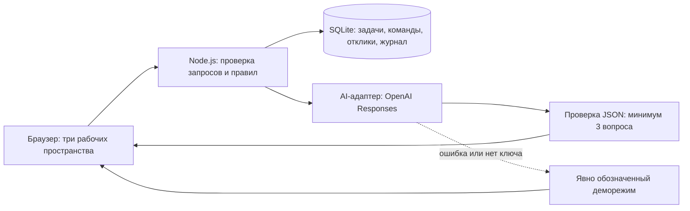

# hack-a1c6ab51-smm
Hackathon team repository for SMM
Статус: в разработке. Подготовка к сдаче продолжается»
[README.md](https://github.com/user-attachments/files/32556851/README.md)
# Sana — платформа практики AI Sana

Бизнес описывает проблему. Помощник задаёт вопросы. Человек подтверждает карточку, получает прозрачный рейтинг и публикует задачу. Команды предлагают решения, бизнес выбирает партнёров и принимает выполненный этап.

Это работающий локальный MVP — первая версия продукта. В нём есть сервер, SQLite, подключение настоящей AI-модели, три рабочих пространства, журнал действий и автоматические проверки. Регистрация и чат намеренно не входят в объём хакатона.

## Быстрый запуск

1. Распакуйте архив `ai-sana.zip`.
2. В Windows дважды нажмите `start.cmd` внутри папки `ai-sana`.
3. Откройте **http://127.0.0.1:4173**.
4. Оставьте окно сервера открытым. Чтобы остановить сервер, нажмите `Ctrl+C`.

Нужен **Node.js 24** — программа, которая запускает JavaScript на сервере. На этом компьютере запускатель умеет находить встроенный Node.js из Codex. На другом компьютере установите Node.js 24. Поддерживается также Node.js от 22.13 с `node:sqlite`.

На macOS/Linux или из терминала Windows:

```text
cd ai-sana
node server.mjs
```

Скачивать библиотеки не требуется: проект использует встроенные модули Node.js. `npm install` не нужен.

Если порт 4173 занят, в PowerShell:

```powershell
$env:PORT = '4174'
node server.mjs
```

Откройте адрес, который напечатает сервер. Если исходный сервер уже работает, достаточно открыть его страницу — второй запуск не нужен.

## Настоящий AI

1. Скопируйте `.env.example` в `.env` рядом с `server.mjs`.
2. В `.env` заполните `OPENAI_API_KEY` своим API-ключом. Не отправляйте его в чат и не добавляйте в архив.
3. При необходимости укажите доступную вашему аккаунту модель в `OPENAI_MODEL`. По умолчанию используется `gpt-4o-mini`.
4. Перезапустите сервер. Создайте черновик и нажмите «Проанализировать описание».
5. Успешный ответ помечается **«Ответ настоящей модели»**. Наличие ключа само по себе не подтверждает доступность сервиса.

Реальный вызов: сервер → OpenAI Responses API → JSON с вопросами. Ключ не попадает в браузер. Отправляются сохранённое описание, тема и поля карточки. В запросе установлено `store:false`. Нужен доступ к API и интернет.

Формат Structured Outputs и расположение `text.format` сверены с [официальной документацией OpenAI](https://developers.openai.com/api/docs/guides/structured-outputs). Прямой ответ API разбирается через `output[].content[]`.

**Честный статус поставки:** на машине сборки API-ключ не был настроен. Живой запрос к OpenAI не выполнялся. Адаптер протестирован с контролируемыми ответами сервиса; офлайн-путь проверен через браузер. При отсутствии ключа работает явно обозначенный демонстрационный помощник, разрешённый кейсом.

Помощник возвращает только вопросы. Он не записывает факты в карточку, не меняет рейтинг и не выбирает команды. Ответы пользователя переносятся в карточку дословно и требуют ручного подтверждения.

При ошибке, отказе, превышении лимита, некорректном JSON или ожидании дольше 25 секунд включается явно обозначенный резервный деморежим. Кнопка «Проверить сбой AI» пропускает повреждённый JSON через тот же валидатор. Промпт, вход и выход доступны прямо под вопросами.

## Что можно показать

- **Обзор:** количество задач, готовность портфеля, сотрудничества, подтверждённые этапы, рейтинг команд и история действий.
- **Кабинет бизнеса:** свободное описание, тематические уточняющие вопросы, карточка, сохранение, подтверждение, публикация и сравнение предложений.
- **Каталог:** поиск, темы, четыре уровня готовности, сортировка по рейтингу/новизне/интересам выбранной команды. Рекомендации основаны на совпадении темы с интересами, а не на скрытой AI-оценке.
- **Команды:** пять профилей с интересами, навыками и технологиями; отклики, решения, отправка этапа и заработанные баллы.
- **Сравнение предложений:** идея, план, срок, прототип, ручной выбор/отклонение, проверка результата.

Переключатель «Смотрю как» — демонстрационная смена роли. Это не вход в защищённый аккаунт. Чтобы сравнивать команды, выберите другой профиль в разделе «Команды и прогресс».

## Все поля карточки

Название; контекст; потребность; пользователи; данные и материалы; ограничения; ожидаемый результат; критерии успеха; контакт; формат взаимодействия; порядок обратной связи. Тема хранится рядом с карточкой. Порядок обратной связи выделен в отдельное поле, чтобы критерий связи с бизнесом был видимым и проверяемым.

## Формула рейтинга

| Показатель | Максимум | Правило |
|---|---:|---|
| Контекст и потребность | 20 | Контекст 10 + потребность 10 |
| Данные и материалы | 20 | Заполненное описание доступных данных или источников |
| Ожидаемый результат | 15 | Заполненный результат |
| Критерии успеха | 15 | Заполненное поле с числовым показателем |
| Ограничения | 10 | Заполненные сроки, технологии или другие границы |
| Пользователи | 10 | Указаны пользователи |
| Связь с бизнесом | 10 | Контакт 5 + формат 3 + обратная связь 2 |

Сумма: **20 + 20 + 15 + 15 + 10 + 10 + 10 = 100**.

Пустые строки, пробелы, «не знаю», «не указано» и похожие явные заглушки баллов не дают. Для критериев успеха используется простая проверка наличия цифры; она не доказывает осмысленность критерия. Контакты не проверяются на существование. Окончательную достоверность подтверждает человек. Это прозрачная оценка заполненности, а не экспертная оценка качества бизнеса.

Предварительный результат виден при редактировании. Действующий рейтинг считается сервером только из `confirmedCard` — подтверждённой версии. Сохранение черновика не меняет баллы. Если опубликованная карточка редактируется, каталог продолжает показывать последний подтверждённый текст и рейтинг, пока бизнес не подтвердит изменения.

| Баллы | Уровень |
|---|---|
| 0–39 | Требует уточнения (уровень «черновик» из кейса) |
| 40–69 | Рабочая |
| 70–89 | Готовая |
| 90–100 | Приоритетная |

Статус «не опубликована» и уровень готовности «черновик» — разные вещи. Даже опубликованная задача с 0 баллов доступна в каталоге и принимает отклики. По умолчанию задачи идут по убыванию рейтинга.

## Решения и прогресс

Предложения не ограничены по количеству. Каждый отклик содержит идею, план, срок и http/https-ссылку. Бизнес вручную выбирает или отклоняет каждый отклик: можно выбрать несколько разных команд или отклонить все.

У выбранного отклика доступен один этап — упрощение по условиям хакатона. Команда отправляет название, описание выполненного и ссылку. До проверки баллы равны прежнему значению. Бизнес отмечает проверку и подтверждает этап: сервер начисляет **25 баллов**. Повторное подтверждение не увеличивает счёт. Это называется идемпотентностью: повтор одного действия не создаёт повторный результат.

## Архитектура



- `server.mjs` — HTTP API, проверка роли демосценария и полей, переходы состояний.
- `storage.mjs` — SQLite, таблицы, внешние ключи и транзакции. Транзакция сохраняет решение, баллы и событие вместе либо откатывает всё при ошибке.
- `ai.mjs` — вызов модели, JSON Schema, ограничение ожидания и резервный режим.
- `public/domain.mjs` — общие поля, формула и валидатор AI. Сервер использует ту же формулу, но сам вычисляет итог; присланные клиентом баллы не принимаются.
- `public/business.js` — кабинет бизнеса, редактор, сравнение откликов.
- `public/catalog.js` — каталог, фильтры, карточка и отправка предложений.
- `public/teams.js` — профили, предложения и сдача этапа.
- `public/overview.js` — общий обзор и журнал.
- `public/app.js`, `public/utils.js` — навигация, запросы и общие элементы.
- `seed.mjs` — по пять синтетических черновиков, опубликованных карточек, команд и предложений.
- `tests/` — автоматические проверки правил и сквозного серверного сценария.

Данные сохраняются в `data/sana.sqlite`. При первом запуске база создаётся автоматически. Архив исходников не содержит рабочую базу: на другом компьютере создадутся чистые тестовые данные. Ссылки `example.com` и адреса в начальном наборе — обозначенные учебные примеры, не действующие прототипы и контакты.

Реализованы версия карточки (`revision`, конфликт возвращает 409), ограничение размера запроса, проверка типов и ссылок, экранирование текста в интерфейсе, ограниченный список публичных файлов и проверка источника изменяющего запроса. Журнал хранится вместе с изменениями. Роль демонстрационная, поэтому это не заменяет авторизацию.

## Честные границы MVP

Один локальный сервер и один процесс. Сервер слушает только `127.0.0.1`, поэтому ссылка открывается на компьютере запуска. Для совместной удалённой работы требуется отдельное развёртывание и настоящая авторизация. В этой сборке их нет, согласно первоначальному ограничению кейса.

Записи содержат JSON-поля, связанные идентификаторами и внешними ключами SQLite. Для небольшого набора сервер читает состояние целиком и сохраняет его в транзакции. Перед тысячами активных пользователей следует добавить постраничные запросы, выборочные обновления, роли с аккаунтами, миграции схемы следующей версии, ограничение запросов к AI и размещение на сервере. Эта сборка не заявляет готовность к такой нагрузке.

Два дополнительных WebMCP-инструмента дают поддерживающему браузеру возможность прочитать каталог и открыть карточку. Они не принимают бизнес-решения. Без поддержки браузера обычный интерфейс работает независимо.

## Проверки и защита

- В Windows запустите `test.cmd`, либо `node --test tests/*.test.mjs`.
- Ручные сценарии: `CHECKLIST.md`.
- Сценарий выступления до 5 минут и готовые тексты: `DEMO.md`.
- Три роли участников, общий формат данных и план на пять часов: `TEAM_PLAN.md`.
- Подробные запросы: `API.md`.
- Фактические результаты проверки сборки: `TEST_REPORT.md`.

Для новой репетиции просто создайте новую задачу. Чтобы начать с чистой базой без удаления старой, остановите сервер и задайте другой файл в PowerShell:

```powershell
$env:DATA_FILE = '.\data\rehearsal-2.sqlite'
node server.mjs
```

Оригинальная база останется на месте. Не запускайте два сервера с одним файлом базы одновременно.
